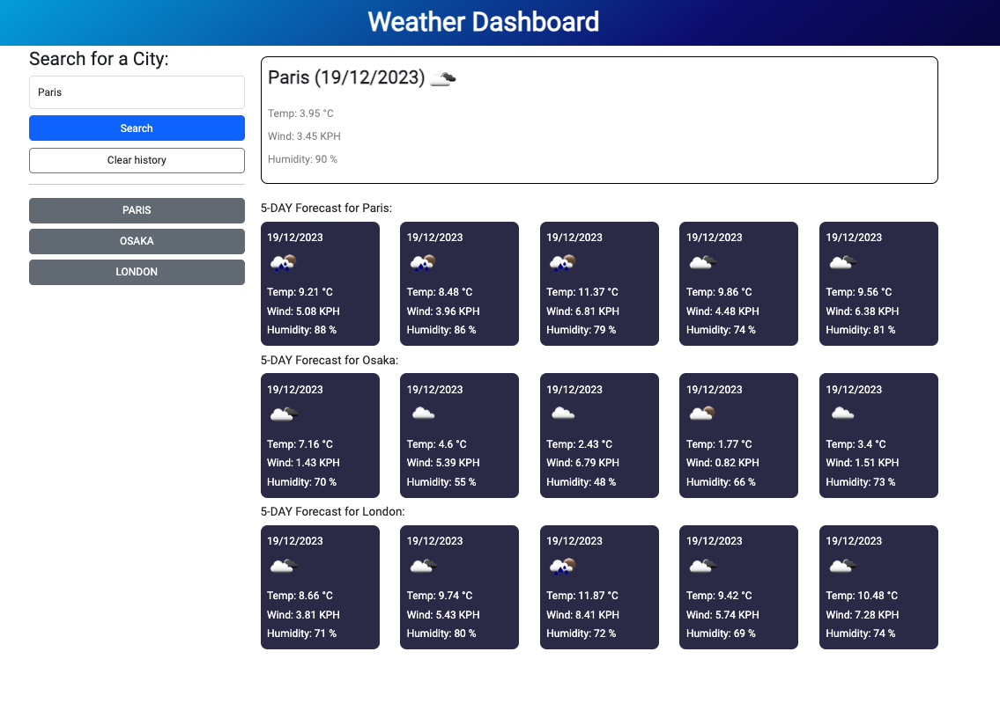

# Weather Dashboard

## About this project

The project involves creating a browser-based weather dashboard that dynamically updates with data retrieved from the 5 Day Weather Forecast API. Developers must register for an API key, which could take up to 2 hours to activate, and learn how to use the API to integrate weather data into their dashboard.

### Built With

- ![HTML]
- ![CSS]
- ![Bootstrap]
- ![JAVASCRIPT]
- ![DAYJS]
- ![JQUERY]
- ![WEBAPI]

### Roadmap

- [x] Create a weather dashboard with form inputs for city search.
- [x] Implement functionality to show current and future weather conditions when a city is searched.
- [x] Add searched cities to a search history.
- [] Display current weather conditions for the selected city, including:
  - [x] City name
  - [x] Date
  - [x] Icon representing weather conditions
  - [x] Temperature
  - [x] Humidity
  - [x] Wind speed
- [x] Show a 5-day forecast for the selected city, featuring:
  - [x] Date
  - [x] Icon representing weather conditions
  - [x] Temperature
  - [x] Humidity
- [] Enable functionality to click on a city in the search history to view its current and future weather conditions again.
- [x] Uses the OpenWeather API
- [x] Add a few validation for search button and error return data
- [x] LocalStorage to store the search history
- [x] Refator the variable name and logic
- [x] Deploy the app to github page

### Mock-up

### Important note

In terms of providing a 5-day weather forecast, one option is to average key data points. However, considering that users of this app do not require detailed weather information, and the app is not intended for in-depth analysis, I decided to opt for simplicity, selecting just one data point from each set of eight, which are collected every three hours, to represent each day's weather. The time is based in London time. and the result do not consider the local time.

### Preview

 it will be added later

#### This is the Github page

[weather-dashboard](https://sebecjeanluc.github.io/weather-dashboard/)

### Credits

This is a practice for the bootcamp. The starter file is protected by the bootcamp.

### Third-party service

[Bootstrap](https://getbootstrap.com/)
[jQuery](https://jquery.com/)
[day.js](https://day.js.org/)
[Weather Forecast API](https://openweathermap.org/forecast5)

### License

Distributed under the MIT License. See `LICENSE.txt` for more information.

## Contact

Tak Kawamura - [@\_takuyakawamura](https://twitter.com/_takuyakawamura) - tkawamura11@gmail.com

<!-- MARKDOWN LINKS & IMAGES -->
<!-- https://www.markdownguide.org/basic-syntax/#reference-style-links -->

[HTML]: https://img.shields.io/badge/HTML-orange
[CSS]: https://img.shields.io/badge/CSS-blue
[BOOTSTRAP]: https://img.shields.io/badge/BOOTSTRAP-lightblue
[JAVASCRIPT]: https://img.shields.io/badge/Javascript-yellow
[JQUERY]: https://img.shields.io/badge/JQUERY-lightblue
[DAYJS]: https://img.shields.io/badge/DAYJS-orange
[WEBAPI]: https://img.shields.io/badge/WEBAPI-orange
